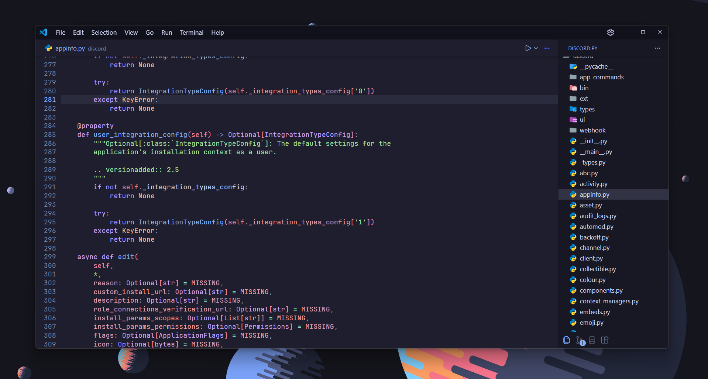
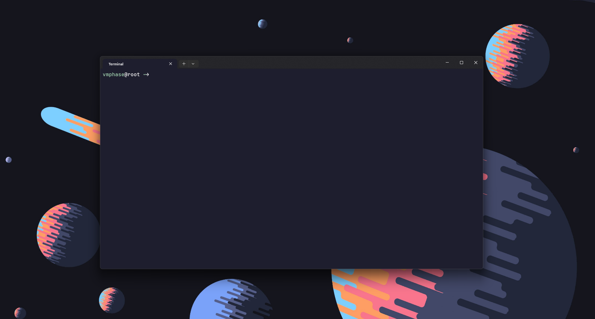
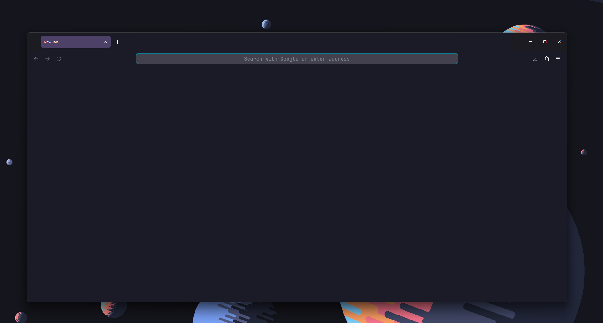

<h1 align="center"> dotfiles </h1>

<div align="center">
  
</div>

<div align="center">
  
  
</div>

---

## Core Info

- **OS:** [Windows 11 25H2](https://www.microsoft.com/en-us/software-download/windows11)
- **Cursor**: [Bibata-Modern](https://github.com/ful1e5/Bibata_Cursor/releases/download/v2.0.7/Bibata-Modern-Classic-Windows.zip)
- **Shell:** [PowerShell](https://learn.microsoft.com/en-us/powershell/) + [OhMyPosh](https://ohmyposh.dev/)
- **Text Editor:** [VSCode](https://code.visualstudio.com/)
- **Browser:** [Firefox](https://www.firefox.com/en/) / [Chromium](https://www.chromium.org/getting-involved/download-chromium/)

---

## Setup

> [!NOTE]
> These dotfiles are **modular, not automatic**.  
> Previously created for personal use.

<details>
<summary><strong>VSCode</strong></summary><br>

- [`config/vscode/vmphase.code-profile`](configs/vscode/vmphase.code-profile)
- [`configs/vscode/settings.json`](configs/vscode/settings.json)

### Extensions

| Extension                | Description                               |
| ------------------------ | ----------------------------------------- |
| Python                   | Python language support                   |
| Python Environments      | Manage Python virtual environments        |
| Pylance                  | Fast, feature-rich Python language server |
| Go                       | Go language support                       |
| Ruff                     | Python linter for fast code checks        |
| YAML                     | YAML syntax support and validation        |
| APC Customize UI ++      | Customize VS Code UI and layout           |
| Catppuccin (Mocha, Blue) | Color theme with blue accent              |
| Material Icon Theme      | File/folder icon theme                    |
| Better Comments          | Highlight and organize comments           |
| Markdown All in One      | Enhanced Markdown editing tools           |
| Code Runner              | Run code snippets quickly                 |
| GitLens                  | Advanced Git features and history         |
| GitHub Actions           | GitHub Actions workflow integration       |
| Database Client          | Manage databases inside VS Code           |
| SQLite Viewer            | Browse SQLite databases visually          |


### Keybinds

| Shortcut                                                                                       | Action                                    |
| ---------------------------------------------------------------------------------------------- | ----------------------------------------- |
| <kbd>ctrl</kbd> + <kbd>shift</kbd> + <kbd>c</kbd>                                              | Open wt (external)                        |
| <kbd>ctrl</kbd> + <kbd>~</kbd>                                                                 | Open wt (internal)                        |
| <kbd>ctrl</kbd> + <kbd>k</kbd>, <kbd>c</kbd>                                                   | Comment selected block of code            |
| <kbd>ctrl</kbd> + <kbd>k</kbd>, <kbd>u</kbd>                                                   | Uncomment selected block of code          |
| <kbd>shift</kbd> + <kbd>↑/↓/←/→</kbd>                                                          | Select/Deselect text or code area         |
| <kbd>ctrl</kbd> + <kbd>p</kbd>                                                                 | Open navigation on recently opened files  |
| <kbd>ctrl</kbd> + <kbd>shift</kbd> + <kbd>p</kbd>                                              | Open Command Palette                      |
| <kbd>ctrl</kbd> + <kbd>shift</kbd> + <kbd>e</kbd> / <kbd>g</kbd> / <kbd>x</kbd> / <kbd>d</kbd> | Switch between panels in Navigation panel |

</details>

<details>
<summary><strong>Firefox</strong></summary><br>

1. Navigate to your default profile folder: `about:profiles`.
2. Apply the configuration: either replace existing files or drop in the new ones.

- [`config/firefox/chrome`](configs/firefox/chrome)
- [`configs/firefox/user.js`](configs/firefox/user.js)

--- 

###  Extensions

| Extension     | Description             |
| ------------- | ----------------------- |
| uBlock Origin | Block Ads & Tracking    |
| RYS           | Customize YouTube       |
| Dark Reader   | Force-dark theme        |
| TWP           | Translate selected text |

---

### Overview
- Blank page (`about:blank`) for both homepage and new tabs.
- Disable sponsored content, top sites, etc.
- Rounded, compact tabs with custom (dark) color-styling.
- Hidden unnecessary icons: tab sound, new tab icon, picture-in-picture, star, tracking, translations.
- Centered URL bar with custom font ([JetBrainsMono](https://www.jetbrains.com/lp/mono/)) & removed borders, separators.

</details>

<details>
<summary><strong>Terminal</strong></summary><br>

### Essentials
- [Windows Terminal](ttps://github.com/microsoft/terminal)
- [PowerShell](https://learn.microsoft.com/ru-ru/powershell/scripting/install/installing-powershell-on-windows)
- [JetBrains Mono Font](https://www.jetbrains.com/lp/mono/)
- [Scoop Manager](https://scoop.sh/)
- [OhMyPosh](https://ohmyposh.dev/)
- [CoreUtils](https://gnuwin32.sourceforge.net/packages/coreutils.htm)

### Windows Terminal
- [`config/terminal/settings.json`](configs/terminal/settings.json)
- Add `--nologo` flag in pwsh profile settings.

### Utilities
```pwsh
# enhanced ls → eza
scoop install eza

# enhanced cat → bat
scoop install bat

# optional
scoop install grep btop ffmpeg nano time
```

### Profile
Edit pwsh profile using `notepad $profile`:
```pwsh
# aliases
Set-Alias -Name ls -Value eza
Set-Alias -Name cat -Value bat

# oh-my-posh init
oh-my-posh init pwsh --config "path_to_custom_theme.json" | Invoke-Expression
```

- [`config/terminal/custom_theme.json`](configs/terminal/custom_theme.json)
- - [`config/terminal/pwsh_profile.ps1`](configs/terminal/pwsh_profile.ps1)

</details>


<br>

<p align="center">
	
</p>

<p align="center">
        <i><code>&copy 2026 <a href="https://github.com/vmphase">vmphase</a></code></i>
</p>
