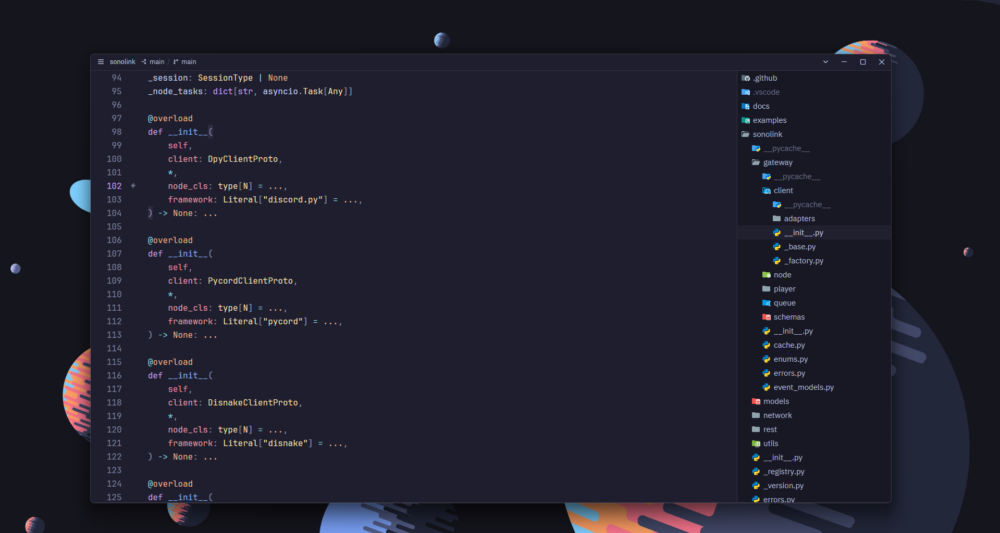
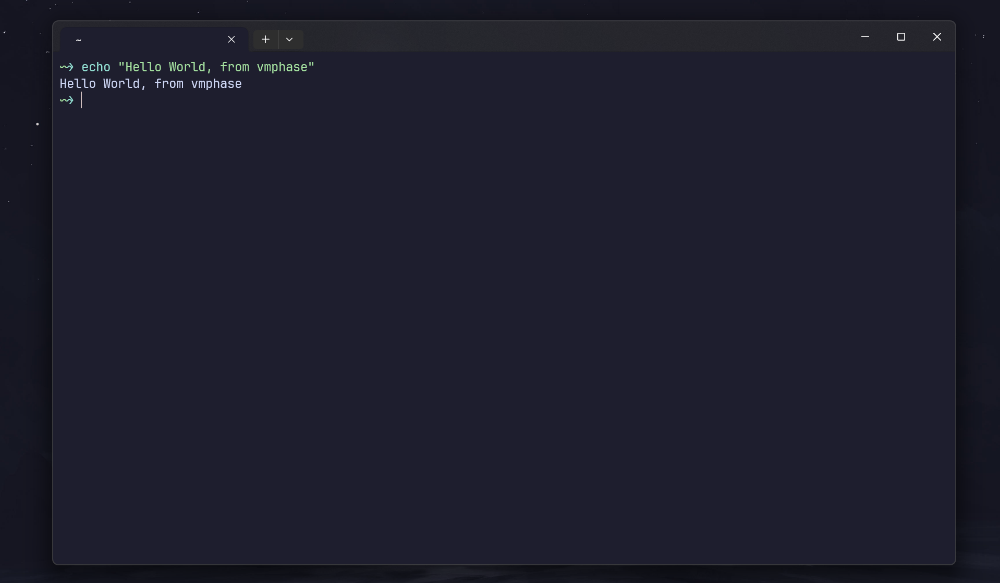
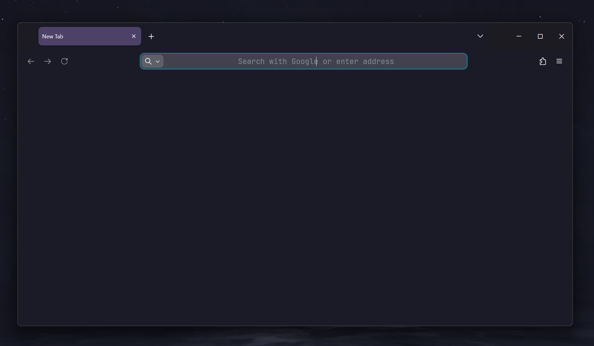

<h1 align="center"> dotfiles </h1>

<div align="center">
  
</div>

<div align="center">
  
  
</div>

---

## Core Info

- **OS:** [Windows 11 25H2](https://www.microsoft.com/en-us/software-download/windows11)
- **Cursor**: [Bibata-Modern](https://github.com/ful1e5/Bibata_Cursor/releases/download/v2.0.7/Bibata-Modern-Classic-Windows.zip)
- **Shell:** [Nushell](https://www.nushell.sh/)
- **Text Editor:** [Zed](https://zed.dev/)
- **Browser:** [Firefox](https://www.firefox.com/en/) / [Chromium](https://www.chromium.org/getting-involved/download-chromium/)

---

## Setup

> [!NOTE]
> These dotfiles are **modular, not automatic**.  
> Created for personal use only.

<details>
<summary><strong>Zed</strong></summary><br>

- [`configs/zed/settings.json`](configs/zed/settings.json)
- [`configs/zed/keymap.json`](configs/zed/keymap.json)

### Keybinds

#### User Interface

| Shortcut                                          | Action                |
| ------------------------------------------------- | --------------------- |
| <kbd>Ctrl</kbd> + <kbd>B</kbd>                    | Toggle left sidebar   |
| <kbd>Ctrl</kbd> + <kbd>E</kbd>                    | Toggle file explorer  |
| <kbd>Ctrl</kbd> + <kbd>G</kbd>                    | Toggle git panel      |
| <kbd>Ctrl</kbd> + <kbd>Alt</kbd> + <kbd>B</kbd>   | Toggle outline panel  |
| <kbd>Ctrl</kbd> + <kbd>Shift</kbd> + <kbd>M</kbd> | Toggle problems panel |
| <kbd>Ctrl</kbd> + <kbd>W</kbd>                    | Close active tab      |
| <kbd>Ctrl</kbd> + <kbd>`</kbd>                    | Toggle terminal       |
| <kbd>Ctrl</kbd> + <kbd>P</kbd>                    | Go to file            |
| <kbd>Ctrl</kbd> + <kbd>Shift</kbd> + <kbd>P</kbd> | Command palette       |

#### Navigation

| Shortcut                                           | Action                        |
| -------------------------------------------------- | ----------------------------- |
| <kbd>F12</kbd> / <kbd>Alt</kbd> + <kbd>Click</kbd> | Go to definition              |
| <kbd>Alt</kbd> + <kbd>F12</kbd>                    | Peek definition               |
| <kbd>Ctrl</kbd> + <kbd>F</kbd>                     | Find in current file          |
| <kbd>Ctrl</kbd> + <kbd>Shift</kbd> + <kbd>F</kbd>  | Find in project               |
| <kbd>Ctrl</kbd> + <kbd>H</kbd>                     | Find & replace (local)        |
| <kbd>Ctrl</kbd> + <kbd>T</kbd>                     | Search symbols (project)      |
| <kbd>Ctrl</kbd> + <kbd>Shift</kbd> + <kbd>O</kbd>  | Search symbols (current file) |
| <kbd>Ctrl</kbd> + <kbd>Shift</kbd> + <kbd>G</kbd>  | Go to line                    |

#### Editing

| Shortcut                                                                       | Action                            |
| ------------------------------------------------------------------------------ | --------------------------------- |
| <kbd>Ctrl</kbd> + <kbd>D</kbd>                                                 | Select next match                 |
| <kbd>Ctrl</kbd> + <kbd>Shift</kbd> + <kbd>L</kbd>                              | Select all occurrences            |
| <kbd>Shift</kbd> + <kbd>↑</kbd>/<kbd>↓</kbd>/<kbd>←</kbd>/<kbd>→</kbd>         | Select text                       |
| <kbd>Ctrl</kbd> + <kbd>Click</kbd>                                             | Add multi-cursor                  |
| <kbd>Shift</kbd> + <kbd>Alt</kbd> + <kbd>F</kbd>                               | Format document                   |
| <kbd>Shift</kbd> + <kbd>Alt</kbd> + <kbd>↑</kbd> / <kbd>↓</kbd>                | Duplicate line up / down          |
| <kbd>Alt</kbd> + <kbd>↑</kbd> / <kbd>↓</kbd>                                   | Swap / move line up / down        |
| <kbd>Ctrl</kbd> + <kbd>Shift</kbd> + <kbd>K</kbd>                              | Delete entire line                |
| <kbd>Ctrl</kbd> + <kbd>Enter</kbd>                                             | Insert line below                 |
| <kbd>Ctrl</kbd> + <kbd>/</kbd> / <kbd>Ctrl</kbd> + <kbd>K</kbd> + <kbd>C</kbd> | Toggle comment / un-comment       |
| <kbd>Shift</kbd> + <kbd>Alt</kbd> + <kbd>A</kbd>                               | Toggle block comment              |
| <kbd>Ctrl</kbd> + <kbd>←</kbd> / <kbd>→</kbd>                                  | Move cursor word-by-word          |
| <kbd>Ctrl</kbd> + <kbd>Backspace</kbd> / <kbd>Ctrl</kbd> + <kbd>Delete</kbd>   | Delete previous / next whole word |
| <kbd>Ctrl</kbd> + <kbd>Space</kbd>                                             | Trigger suggestion                |
| <kbd>Ctrl</kbd> + <kbd>.</kbd>                                                 | Trigger code action (quick fix)   |

</details>

<details>
<summary><strong>Firefox</strong></summary><br>

1. Navigate to your default profile folder: `about:profiles`.
2. Apply the configuration: either replace existing files or drop in the new ones.

- [`config/firefox/chrome`](configs/firefox/chrome)
- [`configs/firefox/user.js`](configs/firefox/user.js)

---

### Extensions

| Extension     | Description          |
| ------------- | -------------------- |
| uBlock Origin | Block Ads & Tracking |
| Dark Reader   | Force-dark theme     |

---

### Overview

- Blank page (`about:blank`) for both homepage and new tabs.
- Disable sponsored content, top sites, etc.
- Rounded, compact tabs with custom (dark) color-styling.
- Hidden unnecessary icons: tab sound, new tab icon, picture-in-picture, star, tracking, translations.
- Centered URL bar with custom font ([JetBrainsMono](https://www.jetbrains.com/lp/mono/)) & removed borders, separators.

</details>

<details>
<summary><strong>Terminal</strong></summary><br>

- [Nushell](https://www.nushell.sh/)
- [JetBrains Mono Font](https://www.jetbrains.com/lp/mono/)
- [Scoop Manager](https://scoop.sh/)
- [CoreUtils](https://gnuwin32.sourceforge.net/packages/coreutils.htm)

### Windows Terminal

- [`config/terminal/settings.json`](configs/terminal/settings.json)

### Utilities

```sh
# enhanced ls cat grep find
scoop install eza bat ripgrep fd

# optional
scoop install ffmpeg nano fzf gh 7zip
```

Edit nushell config using `notepad $nu.config-path`:

```nu
# environment configuration
$env.config.show_banner = false
$env.PROMPT_COMMAND_RIGHT = ""

# find -> fd
def --wrapped find [...args] {
    if ($in | is-not-empty) {
        builtin find ...$args
    } else {
        fd ...$args
    }
}

# ls -> eza
def --wrapped ls [...args] {
    eza ...$args
}

# aliases
alias cat = bat --style=plain
alias grep = rg
```

- [`config/terminal/config.nu`](configs/terminal/config.nu)

<br>

<p align="center">
	
</p>

<p align="center">
        <i><code>&copy 2026 <a href="https://github.com/vmphase">vmphase</a></code></i>
</p>
