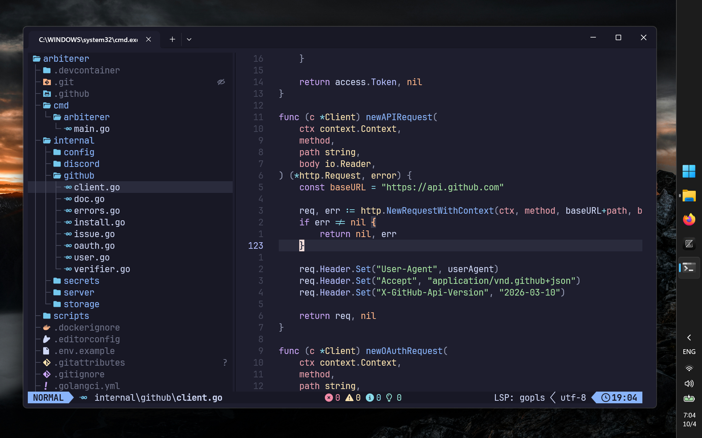
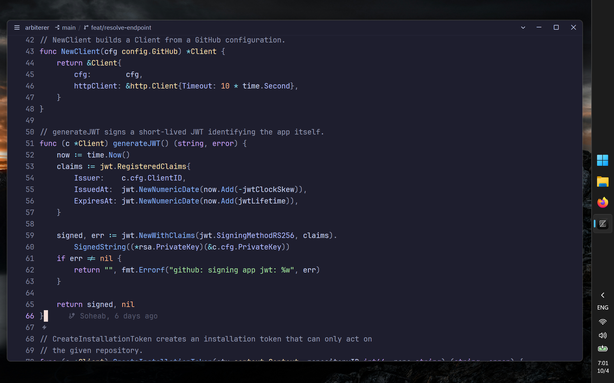
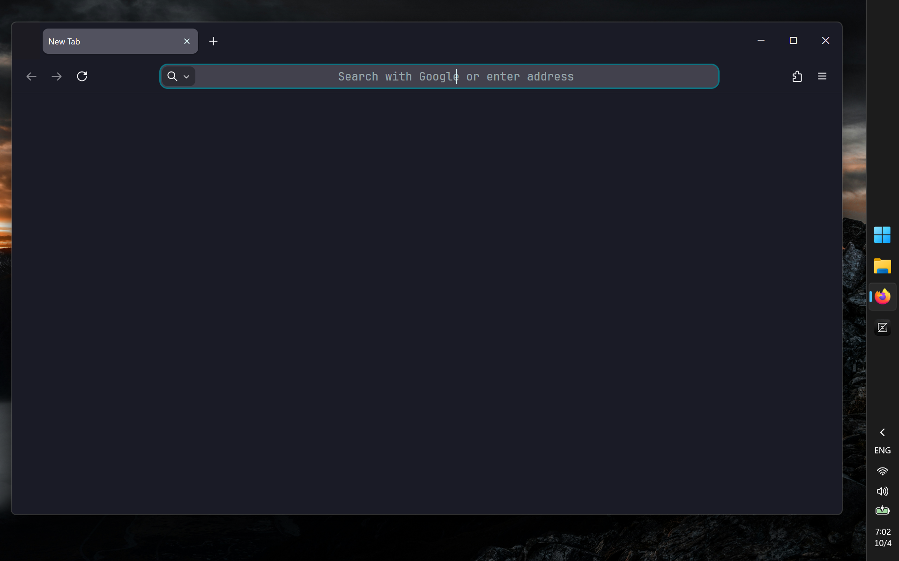

<h1 align="center"> dotfiles </h1>

<div align="center">
  
</div>

<div align="center">
  
  
</div>

---

## Core Info

- **OS:** [Windows 11 26H2](https://www.microsoft.com/en-us/software-download/windows11)
- **Cursor**: [Bibata-Modern](https://github.com/ful1e5/Bibata_Cursor/releases/download/v2.0.7/Bibata-Modern-Classic-Windows.zip)
- **Terminal / Shell:** [Windows Terminal](https://github.com/microsoft/terminal) / [Nushell](https://www.nushell.sh/)
- **Package Manager:** [Scoop](https://scoop.sh/)
- **Text Editor:** [Neovim](https://neovim.io/) / [Zed](https://zed.dev/)
- **Browser:** [Firefox](https://www.firefox.com/en/) / [Chrome](https://www.google.com/chrome/)

---

## Setup

> [!NOTE]
> These dotfiles are **modular, not automatic**.
> Created mainly for personal use, thus may not fit everyone.

## Utilities
 
```bash
# core
scoop install git nu neovim
scoop install uutils-coreutils eza bat ripgrep fd

# JetBrainsMono Nerd Font
scoop bucket add nerd-fonts
scoop install JetBrainsMono-NF

# search, github, archives, media, editor
scoop install fzf gh tuicr 7zip ffmpeg nano

# toolchains (neovim treesitter, lsp, go/python projects)
scoop install gcc tree-sitter nodejs go python
```

<details>

<summary><strong>Neovim</strong></summary><br>

Based on [LazyVim](https://www.lazyvim.org/). Copy the folder in `%LOCALAPPDATA%\nvim` (`~/.config/nvim`), replacing the existing one, then run `nvim`. On first launch, lazy.nvim installs the plugins automatically.

- [`.config/nvim`](.config/nvim)

</details>

<details>

<summary><strong>Zed</strong></summary><br>

Copy both files into Zed's config folder, replacing the existing ones to `%APPDATA%\Zed` (`~/.config/zed`).

- [`.config/zed/settings.json`](.config/zed/settings.json)
- [`.config/zed/keymap.json`](.config/zed/keymap.json)

</details>

<details>

<summary><strong>Firefox</strong></summary><br>

1. Navigate to your default profile folder: `about:profiles`.
2. Apply the configuration: either replace existing files or drop in the new ones.

- [`.config/firefox/chrome`](.config/firefox/chrome)
- [`.config/firefox/user.js`](.config/firefox/user.js)

---

### Extensions

| Extension     | Description          |
| ------------- | -------------------- |
| uBlock Origin | Block Ads & tracking |
| Dark Reader   | Force-dark theme     |

</details>

<details>

<summary><strong>Terminal</strong></summary><br>

### Windows Terminal

Update the default windows terminal settings:

```bash
cp .config/terminal/wt.settings.json /path/to/wt-settings
```

- [`.config/terminal/wt.settings.json`](.config/terminal/wt.settings.json)

### Nushell

Update the default nushell config:

```bash
cp .config/terminal/nushell.config.nu $nu.config-path
```

- [`.config/terminal/nushell.config.nu`](.config/terminal/nushell.config.nu)

</details>

<br>

<p align="center">
	
</p>

<p align="center">
        <i><code>&copy; 2026 <a href="https://github.com/vmphase">vmphase</a></code></i>
</p>
